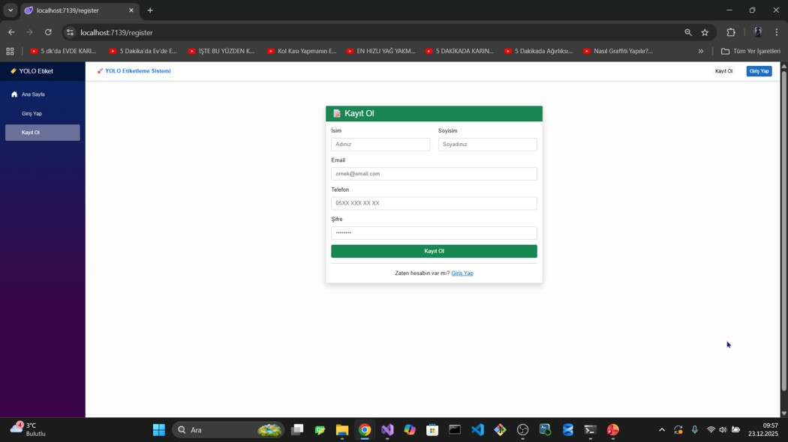

# 🏷️ YOLO Etiket - Web Tabanlı Görsel Etiketleme & Veri Seti Platformu


**YOLO Etiket**, bilgisayarlı görü (Computer Vision) projeleriniz için tarayıcı üzerinden hızlı, sezgisel ve ekiplerle paylaşımlı olarak YOLO formatında veri setleri oluşturmanızı sağlayan modern bir görsel etiketleme (image annotation) platformudur.

---

## 📸 Ekran Görüntüleri (UI Showcase)

### 1. Karşılama ve Kullanıcı Yönetimi
Kullanıcılar sisteme hızlıca kayıt olabilir, giriş yapabilir ve kişisel çalışma paneline erişebilir.

| Kayıt Ol (Register) | Giriş Yap (Login) | Kullanıcı Kontrol Paneli |
| :---: | :---: | :---: |
|  |  |  |

---

### 2. Proje Yönetimi & Kod ile İş Birliği
Her etiketleme oturumu için benzersiz bir **6 haneli paylaşım kodu** üretilir. Ekip üyeleri bu kodu girerek projeye anında dahil olabilir.

| Yeni Proje Oluşturma | Projelerim & Kod Paylaşımı | Kod ile Projeye Katılma |
| :---: | :---: | :---: |
|  |  |  |

---

### 3. Çoklu Görsel Yükleme ve Etiketleme Arayüzü
Görseller toplu olarak yüklendikten sonra dinamik kanvas üzerinde nesneler işaretlenir ve etiket koordinatları anlık olarak listelenir.

| Toplu Görsel Yükleme (Batch Upload) | İnteraktif Bounding Box Etiketleme Alanı |
| :---: | :---: |
|  |  |

---

### 4. Tek Tıkla YOLO Dataset İndirme
Etiket koordinatları otomatik normalize edilerek model eğitimine hazır (YOLOv5, YOLOv8, YOLOv11) ZIP paketi olarak sunulur.

<p align="center">
  
</p>

---

## 🗄️ Veritabanı Mimarisi

Sistem; kullanıcılar, görsel kümeleri, görseller ve koordinat verilerini ilişkisel model kurallarına uygun biçimde saklar:

<p align="center">
  
</p>

### Tablo İlişkileri:
* **Users (1:N) ImageSets**: Bir kullanıcı birden çok proje/görsel seti oluşturabilir.
* **ImageSets (1:N) Images**: Her görsel seti kendi içerisinde çok sayıda görsel dosyasını barındırır.
* **Images (1:N) EtiketlenenImages**: Her görsel üzerinde birden fazla sınır kutusu (bounding box) etiketi bulunabilir.
* **Users (1:N) EtiketlenenImages**: Hangi etiketin hangi kullanıcı tarafından işaretlendiği kaydedilir.

---

## 📋 Öne Çıkan Özellikler

* **Kullanıcı Yönetimi**: Güvenli kayıt, giriş ve oturum takibi.
* **6 Haneli Paylaşım Kodu**: Veri setini ekip üyeleriyle hızlıca paylaşarak senkronize etiketleme.
* **Toplu Dosya Yükleme**: JPG, JPEG, PNG, GIF, BMP formatlarında çoklu görsel aktarımı.
* **Dinamik Bounding Box**: Tarayıcı üzerinden gecikmesiz nesne sınır kutusu çizimi ve sınıflandırma.
* **Normalize YOLO Koordinatları**: Anlık `(x_center, y_center, width, height)` dönüşümü.
* **Eğitime Hazır Export Paketi**: `images/`, `labels/`, `data.yaml` ve `classes.txt` dosyalarını içeren otomatik ZIP yapısı.

---

## 🛠️ Teknoloji Yığını

* **Backend**: ASP.NET Core Web API (.NET 8)
* **Frontend**: Blazor Web App (Interactive Server Mode) & Razor Components
* **Stil / Arayüz**: Bootstrap & Özel CSS
* **ORM / Veritabanı**: Entity Framework Core (Code First) & SQL Server / PostgreSQL
* **Mimari**: Katmanlı Mimari (API, Blazor UI ve Shared DTO Class Library)

---

## 📁 Çözüm & Dizin Yapısı

```text
EtiketSolution/
├── EtiketAPI/                 # RESTful Web API Katmanı
│   ├── Controllers/           # UserController, ImageController, EtiketController, ExportController
│   ├── Services/              # İş mantığı, dosya işleme ve export servisleri
│   ├── Data/                  # DbContext ve Migration dosyaları
│   └── Program.cs
├── EtiketBlazor/              # Blazor Web App (İstemci Katmanı)
│   ├── Pages/                 # Proje, Etiketleme, Galeri, Export Razor sayfaları
│   ├── Components/            # Bounding Box çizim ve interaktif bileşenler
│   ├── Services/              # Backend API haberleşme servisleri
│   └── Program.cs
└── Shared/ClassLibrary/       # Paylaşılan Tipler
    ├── DTOs/                  # Request & Response Veri Transfer Nesneleri
    └── Models/                # Ortak varlık modelleri
